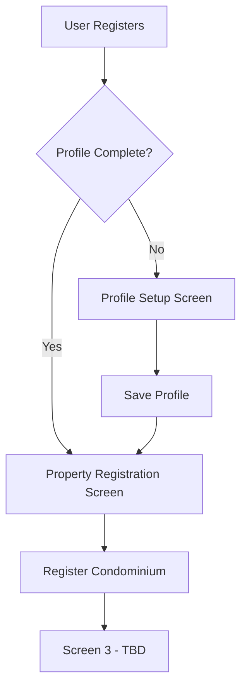

# Design Document: Admin Post-Registration Flow

## Overview

The admin post-registration flow guides newly registered administrators through a three-screen onboarding process to complete their profile and register their first property. This flow ensures administrators provide essential information before accessing the main application features.

The implementation follows Angular 18's standalone component architecture with Atomic Design principles, using RxJS for reactive state management and Angular's Reactive Forms for validation.

## Architecture

### High-Level Flow



### Component Hierarchy

```
Pages (Route-level orchestrators)
├── profile-setup-page
│   └── profile-setup-template
│       └── profile-setup-form (organism)
│           ├── form-field (molecule)
│           │   └── text-input (atom)
│           └── button (atom)
│
└── property-registration-page
    └── property-registration-template
        └── property-registration-form (organism)
            ├── form-field (molecule)
            │   ├── text-input (atom)
            │   └── select-input (atom)
            └── button (atom)
```

### Routing Structure

```typescript
// Routes to be added to app.routes.ts
{
  path: 'admin/onboarding',
  children: [
    {
      path: 'profile',
      component: ProfileSetupPageComponent,
      canActivate: [OnboardingGuard]
    },
    {
      path: 'property',
      component: PropertyRegistrationPageComponent,
      canActivate: [OnboardingGuard]
    },
    {
      path: 'complete',
      component: OnboardingCompletePageComponent,
      canActivate: [OnboardingGuard]
    }
  ]
}
```

## Components and Interfaces

### 1. Atoms

#### 1.1 Select Input Component (New)

**Location:** `src/app/ui/atoms/select-input/`

**Purpose:** Reusable dropdown selector for form inputs

**Interface:**
```typescript
@Component({
  selector: 'app-select-input',
  standalone: true,
  imports: [CommonModule, ReactiveFormsModule]
})
export class SelectInputComponent {
  @Input() id: string = '';
  @Input() placeholder: string = 'Select an option';
  @Input() options: SelectOption[] = [];
  @Input() value: string = '';
  @Input() disabled: boolean = false;
  @Input() error: boolean = false;
  @Output() valueChange = new EventEmitter<string>();
  @Output() blur = new EventEmitter<void>();
  @Output() focus = new EventEmitter<void>();
}

interface SelectOption {
  value: string;
  label: string;
}
```

**Behavior:**
- Renders a styled dropdown with provided options
- Emits valueChange event when selection changes
- Supports disabled state and error styling
- Accessible with proper ARIA labels

#### 1.2 Icon Component (Existing)

**Location:** `src/app/ui/atoms/icon/`

**Usage:** Display building icon on property registration screen

### 2. Molecules

#### 2.1 Form Field Component (Existing)

**Location:** `src/app/ui/molecules/form-field/`

**Usage:** Wraps input atoms with label and error message display

**Enhancement needed:** Support for select-input atom

### 3. Organisms

#### 3.1 Profile Setup Form

**Location:** `src/app/ui/organisms/profile-setup-form/`

**Purpose:** Complete form for administrator profile information

**Interface:**
```typescript
@Component({
  selector: 'app-profile-setup-form',
  standalone: true,
  imports: [
    CommonModule,
    ReactiveFormsModule,
    FormFieldComponent,
    TextInputComponent,
    ButtonComponent
  ]
})
export class ProfileSetupFormComponent implements OnInit, OnDestroy {
  @Input() initialData?: ProfileSetupData;
  @Output() formSubmit = new EventEmitter<ProfileSetupData>();
  @Output() formCancel = new EventEmitter<void>();
  
  form!: FormGroup;
  private destroy$ = new Subject<void>();
}

interface ProfileSetupData {
  fullName: string;
  phoneNumber: string;
  adminId: string;
}
```

**Form Structure:**
```typescript
this.form = this.fb.group({
  fullName: ['', [
    Validators.required,
    Validators.minLength(2),
    Validators.maxLength(100),
    Validators.pattern(/^[a-zA-ZáéíóúÁÉÍÓÚñÑ\s]+$/)
  ]],
  phoneNumber: ['', [
    Validators.required,
    Validators.pattern(/^\+?[0-9\s\-\(\)]+$/)
  ]],
  adminId: ['', [
    Validators.required,
    Validators.minLength(3),
    Validators.maxLength(50)
  ]]
});
```

**Validation Rules:**
- Full Name: Required, 2-100 characters, letters and spaces only
- Phone Number: Required, valid phone format (supports international)
- Admin ID: Required, 3-50 characters

#### 3.2 Property Registration Form

**Location:** `src/app/ui/organisms/property-registration-form/`

**Purpose:** Complete form for property registration

**Interface:**
```typescript
@Component({
  selector: 'app-property-registration-form',
  standalone: true,
  imports: [
    CommonModule,
    ReactiveFormsModule,
    FormFieldComponent,
    TextInputComponent,
    SelectInputComponent,
    ButtonComponent,
    IconComponent
  ]
})
export class PropertyRegistrationFormComponent implements OnInit, OnDestroy {
  @Input() initialData?: PropertyRegistrationData;
  @Output() formSubmit = new EventEmitter<PropertyRegistrationData>();
  @Output() formCancel = new EventEmitter<void>();
  
  form!: FormGroup;
  propertyTypeOptions: SelectOption[] = [
    { value: 'conjunto', label: 'Conjunto' },
    { value: 'ciudadela', label: 'Ciudadela' },
    { value: 'condominio', label: 'Condominio' }
  ];
  private destroy$ = new Subject<void>();
}

interface PropertyRegistrationData {
  condominiumName: string;
  taxId: string;
  totalUnits: number;
  propertyType: 'conjunto' | 'ciudadela' | 'condominio';
}
```

**Form Structure:**
```typescript
this.form = this.fb.group({
  condominiumName: ['', [
    Validators.required,
    Validators.minLength(2),
    Validators.maxLength(100)
  ]],
  taxId: ['', [
    Validators.required,
    Validators.pattern(/^\d{2}\.\d{3}\.\d{3}\/\d{4}-\d{2}$/)
  ]],
  totalUnits: ['', [
    Validators.required,
    Validators.min(1),
    Validators.pattern(/^\d+$/)
  ]],
  propertyType: ['', Validators.required]
});
```

**Validation Rules:**
- Condominium Name: Required, 2-100 characters
- Tax ID / CNPJ: Required, format XX.XXX.XXX/XXXX-XX
- Total Units: Required, minimum 1, numeric only
- Property Type: Required, one of the three options

### 4. Templates

#### 4.1 Profile Setup Template

**Location:** `src/app/ui/templates/profile-setup-template/`

**Purpose:** Layout structure for profile setup screen

**Interface:**
```typescript
@Component({
  selector: 'app-profile-setup-template',
  standalone: true,
  imports: [
    CommonModule,
    ProfileSetupFormComponent,
    ButtonComponent
  ]
})
export class ProfileSetupTemplateComponent {
  @Input() isSubmitting: boolean = false;
  @Input() initialData?: ProfileSetupData;
  @Output() formSubmit = new EventEmitter<ProfileSetupData>();
  @Output() backClick = new EventEmitter<void>();
}
```

**Layout:**
- Back button (top-left)
- Title: "Profile Setup"
- Profile setup form (centered)
- Responsive padding and spacing

#### 4.2 Property Registration Template

**Location:** `src/app/ui/templates/property-registration-template/`

**Purpose:** Layout structure for property registration screen

**Interface:**
```typescript
@Component({
  selector: 'app-property-registration-template',
  standalone: true,
  imports: [
    CommonModule,
    PropertyRegistrationFormComponent,
    ButtonComponent,
    IconComponent
  ]
})
export class PropertyRegistrationTemplateComponent {
  @Input() isSubmitting: boolean = false;
  @Input() initialData?: PropertyRegistrationData;
  @Output() formSubmit = new EventEmitter<PropertyRegistrationData>();
  @Output() backClick = new EventEmitter<void>();
}
```

**Layout:**
- Back button (top-left)
- Building icon (centered)
- Title: "New Condominium"
- Subtitle: "Register a new property to manage"
- Property registration form (centered)
- Responsive padding and spacing

### 5. Pages

#### 5.1 Profile Setup Page

**Location:** `src/app/pages/admin-onboarding/profile-setup-page/`

**Purpose:** Route-level orchestrator for profile setup

**Interface:**
```typescript
@Component({
  selector: 'app-profile-setup-page',
  standalone: true,
  imports: [ProfileSetupTemplateComponent]
})
export class ProfileSetupPageComponent implements OnInit {
  isSubmitting: boolean = false;
  initialData?: ProfileSetupData;
  
  constructor(
    private adminProfileService: AdminProfileService,
    private router: Router
  ) {}
  
  ngOnInit(): void {
    // Check if profile is already complete
    this.checkProfileCompletion();
  }
  
  handleSubmit(data: ProfileSetupData): void {
    // Save profile and navigate to property registration
  }
  
  handleBack(): void {
    // Navigate to previous screen
  }
  
  private checkProfileCompletion(): void {
    // If profile complete, redirect to property registration
  }
}
```

**Responsibilities:**
- Check profile completion state on init
- Handle form submission via AdminProfileService
- Navigate to property registration on success
- Handle back navigation
- Manage loading states

#### 5.2 Property Registration Page

**Location:** `src/app/pages/admin-onboarding/property-registration-page/`

**Purpose:** Route-level orchestrator for property registration

**Interface:**
```typescript
@Component({
  selector: 'app-property-registration-page',
  standalone: true,
  imports: [PropertyRegistrationTemplateComponent]
})
export class PropertyRegistrationPageComponent {
  isSubmitting: boolean = false;
  initialData?: PropertyRegistrationData;
  
  constructor(
    private propertyService: PropertyService,
    private router: Router
  ) {}
  
  handleSubmit(data: PropertyRegistrationData): void {
    // Save property and navigate to screen 3
  }
  
  handleBack(): void {
    // Navigate to profile setup
  }
}
```

**Responsibilities:**
- Handle form submission via PropertyService
- Navigate to screen 3 on success
- Handle back navigation to profile setup
- Manage loading states

## Data Models

### Profile Setup Data Model

**Location:** `src/app/models/admin-profile.model.ts`

```typescript
export interface AdminProfile {
  id: string;
  userId: string;
  fullName: string;
  phoneNumber: string;
  adminId: string;
  profileComplete: boolean;
  createdAt: string;
  updatedAt: string;
}

export interface ProfileSetupData {
  fullName: string;
  phoneNumber: string;
  adminId: string;
}

export interface ProfileSetupRequest {
  fullName: string;
  phoneNumber: string;
  adminId: string;
}

export interface ProfileSetupResponse {
  success: boolean;
  profile?: AdminProfile;
  error?: string;
}
```

### Property Registration Data Model

**Location:** `src/app/models/property.model.ts`

```typescript
export interface Property {
  id: string;
  name: string;
  taxId: string;
  totalUnits: number;
  propertyType: PropertyType;
  adminId: string;
  status: PropertyStatus;
  createdAt: string;
  updatedAt: string;
}

export type PropertyType = 'conjunto' | 'ciudadela' | 'condominio';

export enum PropertyStatus {
  ACTIVE = 'ACTIVE',
  INACTIVE = 'INACTIVE',
  PENDING = 'PENDING'
}

export interface PropertyRegistrationData {
  condominiumName: string;
  taxId: string;
  totalUnits: number;
  propertyType: PropertyType;
}

export interface PropertyRegistrationRequest {
  name: string;
  taxId: string;
  totalUnits: number;
  propertyType: PropertyType;
}

export interface PropertyRegistrationResponse {
  success: boolean;
  property?: Property;
  error?: string;
}
```

## Services

### Admin Profile Service

**Location:** `src/app/services/admin-profile.service.ts`

**Purpose:** Manage administrator profile data and completion state

**Interface:**
```typescript
@Injectable({ providedIn: 'root' })
export class AdminProfileService {
  private profileComplete$ = new BehaviorSubject<boolean>(false);
  
  constructor(private http: HttpClient) {}
  
  // Check if profile is complete
  isProfileComplete(): Observable<boolean> {
    return this.profileComplete$.asObservable();
  }
  
  // Get current profile
  getProfile(): Observable<AdminProfile | null> {
    // Implementation
  }
  
  // Save profile setup data
  saveProfile(data: ProfileSetupRequest): Observable<ProfileSetupResponse> {
    // Implementation
  }
  
  // Update profile completion state
  private updateProfileCompletionState(complete: boolean): void {
    this.profileComplete$.next(complete);
  }
}
```

**Methods:**
- `isProfileComplete()`: Returns observable of profile completion state
- `getProfile()`: Fetches current admin profile
- `saveProfile(data)`: Saves profile setup data and updates completion state
- `updateProfileCompletionState(complete)`: Internal method to update state

### Property Service

**Location:** `src/app/services/property.service.ts`

**Purpose:** Manage property registration and data

**Interface:**
```typescript
@Injectable({ providedIn: 'root' })
export class PropertyService {
  constructor(private http: HttpClient) {}
  
  // Register new property
  registerProperty(data: PropertyRegistrationRequest): Observable<PropertyRegistrationResponse> {
    // Implementation
  }
  
  // Get properties for current admin
  getAdminProperties(): Observable<Property[]> {
    // Implementation
  }
  
  // Get single property by ID
  getProperty(id: string): Observable<Property> {
    // Implementation
  }
}
```

**Methods:**
- `registerProperty(data)`: Creates new property and associates with admin
- `getAdminProperties()`: Fetches all properties for current admin
- `getProperty(id)`: Fetches single property by ID

### Onboarding Guard

**Location:** `src/app/guards/onboarding.guard.ts`

**Purpose:** Control access to onboarding screens based on completion state

**Interface:**
```typescript
@Injectable({ providedIn: 'root' })
export class OnboardingGuard implements CanActivate {
  constructor(
    private adminProfileService: AdminProfileService,
    private router: Router
  ) {}
  
  canActivate(
    route: ActivatedRouteSnapshot,
    state: RouterStateSnapshot
  ): Observable<boolean | UrlTree> {
    // Check profile completion and route accordingly
  }
}
```

**Logic:**
- If accessing `/admin/onboarding/profile` and profile complete → redirect to `/admin/onboarding/property`
- If accessing `/admin/onboarding/property` and profile incomplete → redirect to `/admin/onboarding/profile`
- If accessing `/admin/onboarding/complete` and property not registered → redirect to `/admin/onboarding/property`

## Correctness Properties

*A property is a characteristic or behavior that should hold true across all valid executions of a system—essentially, a formal statement about what the system should do. Properties serve as the bridge between human-readable specifications and machine-verifiable correctness guarantees.*

### Property 1: Profile completion state persistence and navigation

*For any* administrator who successfully saves their profile, querying the profile completion state should return true, and subsequent visits to the onboarding flow should automatically navigate to the property registration screen, bypassing the profile setup screen.

**Validates: Requirements 1.2, 3.2, 7.5**

### Property 2: Form validation consistency

*For any* form (profile setup or property registration), when all required fields contain valid data according to their validation rules, the form should be marked as valid and the submit button should be enabled.

**Validates: Requirements 2.5, 5.8, 8.3**

### Property 3: Sequential navigation flow

*For any* administrator in the onboarding flow, completing the profile setup screen should navigate to the property registration screen, completing the property registration screen should navigate to screen 3, and clicking the back button should navigate to the previous screen in the sequence.

**Validates: Requirements 4.1, 7.2, 7.3, 7.4**

### Property 4: Data persistence round-trip

*For any* valid profile data or property data, saving the data then immediately retrieving it should return equivalent data with all fields preserved.

**Validates: Requirements 3.1, 6.1**

### Property 5: Reactive validation and error display

*For any* form input change, the form validity state should be re-evaluated immediately, and when validation errors occur, the system should display clear, descriptive error messages below the relevant input fields.

**Validates: Requirements 8.1, 8.2, 8.5, 10.2**

### Property 6: Phone number format acceptance

*For any* string that matches the pattern of a valid phone number (with or without country code, with various formatting characters like spaces, dashes, or parentheses), the phone number validator should accept it as valid.

**Validates: Requirements 2.4**

### Property 7: Tax ID format validation

*For any* string that does not match the exact format "XX.XXX.XXX/XXXX-XX" (where X is a digit), the tax ID validator should reject it as invalid.

**Validates: Requirements 5.3**

### Property 8: Numeric field validation

*For any* input in the Total Units field, if the value contains non-numeric characters or is less than 1, the validator should mark the field as invalid.

**Validates: Requirements 5.5, 5.6**

### Property 9: Form submission with invalid data

*For any* form (profile setup or property registration) that is invalid, when the administrator attempts to submit, the system should display validation error messages and prevent navigation to the next screen.

**Validates: Requirements 3.4, 6.4**

### Property 10: Back navigation without data persistence

*For any* screen in the onboarding flow, when the administrator clicks the back button, the system should navigate to the previous screen without persisting any form data entered on the current screen.

**Validates: Requirements 3.5, 6.5**

### Property 11: Keyboard accessibility

*For any* form in the onboarding flow, all form fields should be navigable using the Tab key, all input fields should display a visual focus indicator when focused, and all form inputs and buttons should have appropriate ARIA labels.

**Validates: Requirements 10.1, 10.3, 10.4**

### Property 12: Loading state feedback

*For any* form submission (profile setup or property registration), during the asynchronous data persistence operation, the system should display visual feedback (loading state) and disable the submit button to prevent duplicate submissions.

**Validates: Requirements 10.5**

## Error Handling

### Form Validation Errors

**Strategy:** Display inline error messages below each field

**Error Messages:**
- Full Name:
  - Empty: "Full name is required"
  - Too short: "Full name must be at least 2 characters"
  - Invalid characters: "Full name can only contain letters and spaces"
- Phone Number:
  - Empty: "Phone number is required"
  - Invalid format: "Please enter a valid phone number"
- Admin ID:
  - Empty: "Admin ID is required"
  - Too short: "Admin ID must be at least 3 characters"
- Condominium Name:
  - Empty: "Condominium name is required"
  - Too short: "Name must be at least 2 characters"
- Tax ID / CNPJ:
  - Empty: "Tax ID is required"
  - Invalid format: "Tax ID must match format XX.XXX.XXX/XXXX-XX"
- Total Units:
  - Empty: "Total units is required"
  - Invalid value: "Total units must be at least 1"
  - Non-numeric: "Total units must be a number"
- Property Type:
  - Empty: "Property type is required"

### Service Errors

**Strategy:** Display general error message at top of form

**Error Scenarios:**
1. **Network Error:** "Unable to connect. Please check your internet connection and try again."
2. **Server Error (500):** "Something went wrong on our end. Please try again later."
3. **Validation Error (400):** Display specific error message from server
4. **Duplicate Error (409):** "This [admin ID / tax ID] is already registered."
5. **Timeout Error:** "Request timed out. Please try again."

**Implementation:**
```typescript
private handleError(error: any): void {
  this.isSubmitting = false;
  
  if (error.status === 0 || error.name === 'TimeoutError') {
    this.generalError = 'Unable to connect. Please check your internet connection and try again.';
  } else if (error.status === 400) {
    this.generalError = error.error?.message || 'Please check your input and try again.';
  } else if (error.status === 409) {
    this.generalError = error.error?.message || 'This information is already registered.';
  } else if (error.status === 500) {
    this.generalError = 'Something went wrong on our end. Please try again later.';
  } else {
    this.generalError = 'An unexpected error occurred. Please try again.';
  }
}
```

### Guard Errors

**Strategy:** Redirect to appropriate screen with error state

**Scenarios:**
1. **Profile service unavailable:** Redirect to login with error message
2. **Invalid session:** Redirect to login
3. **Unexpected guard error:** Log error and allow navigation (fail open)

## Testing Strategy

### Unit Testing

**Focus Areas:**
- Form validation logic for each field
- Error message generation
- Service method calls and responses
- Guard navigation logic
- Component input/output behavior

**Example Unit Tests:**
```typescript
describe('ProfileSetupFormComponent', () => {
  it('should mark form as invalid when full name is empty', () => {
    // Test specific validation rule
  });
  
  it('should emit formSubmit event when form is valid and submitted', () => {
    // Test event emission
  });
  
  it('should display error message for invalid phone number format', () => {
    // Test error display
  });
});

describe('AdminProfileService', () => {
  it('should update profile completion state after successful save', () => {
    // Test state management
  });
  
  it('should handle network errors gracefully', () => {
    // Test error handling
  });
});

describe('OnboardingGuard', () => {
  it('should redirect to property registration when profile is complete', () => {
    // Test navigation logic
  });
});
```

### Property-Based Testing

**Configuration:**
- Library: `fast-check` (TypeScript property-based testing)
- Minimum iterations: 100 per property test
- Tag format: **Feature: admin-post-registration-flow, Property {number}: {property_text}**

**Property Test Examples:**
```typescript
describe('Property 2: Form validation consistency', () => {
  it('should mark form as valid when all fields have valid data', () => {
    fc.assert(
      fc.property(
        fc.string({ minLength: 2, maxLength: 100 }).filter(s => /^[a-zA-Z\s]+$/.test(s)),
        fc.string().filter(s => /^\+?[0-9\s\-\(\)]+$/.test(s)),
        fc.string({ minLength: 3, maxLength: 50 }),
        (fullName, phoneNumber, adminId) => {
          // Create form with generated valid data
          // Assert form.valid === true
        }
      ),
      { numRuns: 100 }
    );
  });
});

describe('Property 4: Data persistence round-trip', () => {
  it('should preserve all profile data after save and retrieve', () => {
    fc.assert(
      fc.property(
        fc.record({
          fullName: fc.string({ minLength: 2, maxLength: 100 }),
          phoneNumber: fc.string(),
          adminId: fc.string({ minLength: 3, maxLength: 50 })
        }),
        (profileData) => {
          // Save profile data
          // Retrieve profile data
          // Assert retrieved data equals saved data
        }
      ),
      { numRuns: 100 }
    );
  });
});

describe('Property 6: Phone number format acceptance', () => {
  it('should accept various valid phone number formats', () => {
    fc.assert(
      fc.property(
        fc.oneof(
          fc.constant('+1 (555) 123-4567'),
          fc.constant('555-123-4567'),
          fc.constant('+52 55 1234 5678'),
          fc.constant('5551234567')
        ),
        (phoneNumber) => {
          // Validate phone number
          // Assert validation passes
        }
      ),
      { numRuns: 100 }
    );
  });
});

describe('Property 7: Tax ID format validation', () => {
  it('should reject tax IDs that do not match the exact format', () => {
    fc.assert(
      fc.property(
        fc.string().filter(s => !/^\d{2}\.\d{3}\.\d{3}\/\d{4}-\d{2}$/.test(s)),
        (invalidTaxId) => {
          // Validate tax ID
          // Assert validation fails
        }
      ),
      { numRuns: 100 }
    );
  });
});
```

### Integration Testing

**Focus Areas:**
- Complete onboarding flow from profile setup to property registration
- Navigation between screens
- Data persistence across screens
- Guard behavior with different completion states

**Example Integration Tests:**
```typescript
describe('Admin Onboarding Flow Integration', () => {
  it('should complete full onboarding flow successfully', () => {
    // Navigate to profile setup
    // Fill and submit profile form
    // Verify navigation to property registration
    // Fill and submit property form
    // Verify navigation to completion screen
  });
  
  it('should skip profile setup when already complete', () => {
    // Set profile completion state to true
    // Navigate to onboarding
    // Verify direct navigation to property registration
  });
});
```

### Accessibility Testing

**Manual Testing Checklist:**
- Keyboard navigation through all forms
- Screen reader compatibility
- Focus indicators visible
- Error messages announced
- Form labels properly associated

**Automated Accessibility:**
- Use `axe-core` for automated accessibility testing
- Run on each screen component
- Verify WCAG 2.1 Level AA compliance

## Styling and Design

### Color Palette

- Primary Action Button: Coral/Orange (#FF6B6B or similar)
- Background: Light gray or white
- Text: Dark gray (#333333)
- Error: Red (#DC3545)
- Border: Light gray (#E0E0E0)
- Focus: Blue outline (#007BFF)

### Typography

- Title: 24px, bold
- Subtitle: 16px, regular
- Form Labels: 14px, medium
- Input Text: 16px, regular
- Error Messages: 12px, regular
- Button Text: 16px, medium

### Spacing

- Screen padding: 24px
- Form field spacing: 16px
- Button margin top: 24px
- Error message margin top: 4px

### Responsive Design

- Mobile-first approach
- Breakpoints:
  - Mobile: < 768px
  - Tablet: 768px - 1024px
  - Desktop: > 1024px
- Form max-width: 500px (centered on larger screens)

## Implementation Notes

### Angular Reactive Forms

All forms use Angular's Reactive Forms module for:
- Type-safe form controls
- Synchronous validation
- Reactive state management
- Easy testing

### RxJS Patterns

- Use `BehaviorSubject` for profile completion state
- Use `takeUntil` pattern for subscription cleanup
- Use `switchMap` for sequential API calls
- Use `catchError` for error handling

### Form Validation Patterns

```typescript
// Reusable validators
export class CustomValidators {
  static phoneNumber(control: AbstractControl): ValidationErrors | null {
    const phoneRegex = /^\+?[0-9\s\-\(\)]+$/;
    return phoneRegex.test(control.value) ? null : { invalidPhone: true };
  }
  
  static taxId(control: AbstractControl): ValidationErrors | null {
    const taxIdRegex = /^\d{2}\.\d{3}\.\d{3}\/\d{4}-\d{2}$/;
    return taxIdRegex.test(control.value) ? null : { invalidTaxId: true };
  }
}
```

### State Management

- Profile completion state managed by AdminProfileService
- Form state managed by Angular Reactive Forms
- Loading states managed by component properties
- No global state management library needed for this feature

### API Integration

**Endpoints (to be implemented):**
- `POST /api/admin/profile` - Save profile setup
- `GET /api/admin/profile` - Get current profile
- `POST /api/properties` - Register new property
- `GET /api/properties` - Get admin properties

**Request/Response Format:**
- Content-Type: application/json
- Authentication: Bearer token in Authorization header
- Error format: `{ success: false, error: string }`
- Success format: `{ success: true, data: T }`

## Future Enhancements

1. **Profile Photo Upload:** Add image upload capability to profile setup
2. **Location Picker:** Add map-based location picker for property registration
3. **Multi-step Progress Indicator:** Visual progress bar showing completion status
4. **Draft Saving:** Auto-save form data as draft
5. **Property Import:** Bulk import properties from CSV/Excel
6. **Email Verification:** Verify admin email before completing onboarding
7. **SMS Verification:** Verify phone number via SMS code
8. **Property Templates:** Pre-filled templates for common property types
