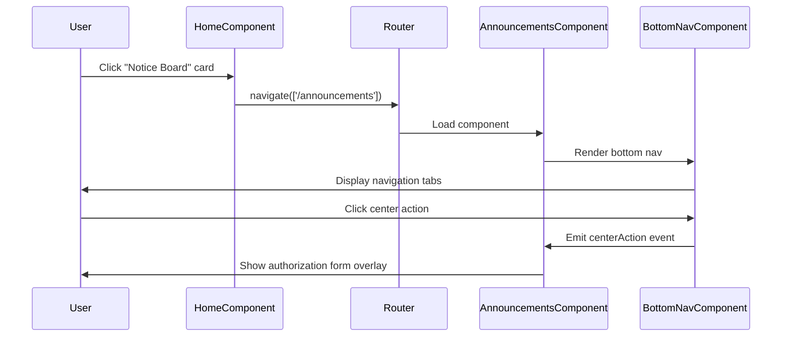

# Design Document: Announcements Navigation with Tab Bar

## Overview

This feature implements navigation from the home page "Notice Board" quick action card to the announcements page and adds the bottom navigation tab bar to the announcements page. The implementation involves:

1. Updating the `onNoticeBoard()` method in the home component to use Angular Router for navigation
2. Adding the `BottomNavComponent` to the announcements page template
3. Implementing the center action handler in the announcements component
4. Adjusting CSS to ensure proper layout with the bottom navigation

The design maintains Angular's standalone component architecture and follows the existing patterns established in the home page implementation.

## Architecture

### Component Interaction Flow



### Routing Architecture

The application uses Angular's lazy-loaded routing with the following structure:
- `/home` → HomeComponent (with bottom nav)
- `/announcements` → AnnouncementsComponent (will have bottom nav added)

Both pages will share the same `BottomNavComponent` instance pattern, where each page component includes the bottom nav in its template.

## Components and Interfaces

### HomeComponent Updates

**File:** `src/app/pages/home/home.component.ts`

**Changes:**
- Inject `Router` service in the constructor
- Update `onNoticeBoard()` method to navigate to `/announcements`
- Add error handling for navigation failures

**Method Signature:**
```typescript
onNoticeBoard(): void {
  this.router.navigate(['/announcements']).catch(error => {
    console.error('Navigation to announcements failed:', error);
  });
}
```

### AnnouncementsComponent Updates

**File:** `src/app/pages/announcements/announcements.component.ts`

**Changes:**
- Import `BottomNavComponent` in the standalone imports array
- Add `showFormOverlay` property to manage authorization form visibility
- Add `onCenterAction()` method to handle the center button click from bottom nav
- Import and add `AuthorizationFormComponent` for the overlay
- Add `onFormCancel()` and `onFormSubmit()` methods to handle form interactions

**New Properties:**
```typescript
showFormOverlay: boolean = false;
```

**New Methods:**
```typescript
onCenterAction(): void {
  this.showFormOverlay = true;
}

onFormCancel(): void {
  this.showFormOverlay = false;
}

onFormSubmit(formValue: AuthorizationFormValue): void {
  console.log('Form submitted from announcements page:', formValue);
  this.showFormOverlay = false;
  // Future: Handle form submission logic
}
```

### AnnouncementsComponent Template Updates

**File:** `src/app/pages/announcements/announcements.component.html`

**Changes:**
- Add `<app-bottom-nav>` component before the closing `</div>` of `.announcements-page`
- Bind the `(centerAction)` output event to `onCenterAction()` method
- Add `<app-authorization-form>` component for the overlay
- Bind form inputs and outputs for visibility and event handling

**Template Addition:**
```html
<!-- Bottom Navigation -->
<app-bottom-nav (centerAction)="onCenterAction()"></app-bottom-nav>

<!-- Authorization Form Overlay -->
<app-authorization-form
  [visible]="showFormOverlay"
  (formSubmit)="onFormSubmit($event)"
  (formCancel)="onFormCancel()"
></app-authorization-form>
```

### AnnouncementsComponent CSS Updates

**File:** `src/app/pages/announcements/announcements.component.css`

**Changes:**
- Add bottom padding to `.announcements-content` to prevent content from being hidden behind the bottom nav
- Ensure the page container allows for fixed positioning of the bottom nav

**CSS Addition:**
```css
.announcements-page {
  min-height: 100vh;
  display: flex;
  flex-direction: column;
  padding-bottom: 80px; /* Space for bottom nav */
}

.announcements-content {
  flex: 1;
  padding-bottom: 20px; /* Additional spacing */
}
```

## Data Models

### AuthorizationFormValue

**File:** `src/app/models/authorization.model.ts`

This model is already defined in the codebase and will be imported for type safety:

```typescript
export interface AuthorizationFormValue {
  // Existing interface definition
  // Used for form submission handling
}
```

No changes to the data model are required; we're reusing the existing interface.

## Correctness Properties


*A property is a characteristic or behavior that should hold true across all valid executions of a system—essentially, a formal statement about what the system should do. Properties serve as the bridge between human-readable specifications and machine-verifiable correctness guarantees.*

### Property 1: Notice Board Navigation Triggers Route Change

*For any* state of the Home_Page component, when the "Notice Board" quick action card is clicked, the Router's navigate method should be called with the route ['/announcements'].

**Validates: Requirements 1.1**

### Property 2: Announcements Page Renders After Navigation

*For any* navigation to the /announcements route, the Announcements_Page should be displayed with its header component and content area present in the DOM.

**Validates: Requirements 1.3**

### Property 3: Bottom Navigation is Fixed at Bottom of Viewport

*For any* rendering of the Announcements_Page, the Bottom_Nav component should be present in the DOM and have CSS positioning that keeps it fixed at the bottom of the viewport.

**Validates: Requirements 2.1, 2.3**

### Property 4: Content Area Has Adequate Padding

*For any* content length on the Announcements_Page, the content container should have bottom padding equal to or greater than the Bottom_Nav height to prevent overlap.

**Validates: Requirements 2.4, 3.2**

### Property 5: Bottom Navigation Items Trigger Route Changes

*For any* clickable navigation item in the Bottom_Nav (excluding the center button), clicking that item should trigger the Router to navigate to the corresponding route.

**Validates: Requirements 4.2**

### Property 6: Center Action Button Shows Authorization Form

*For any* state of the Announcements_Page, when the center action button in the Bottom_Nav is clicked, the showFormOverlay property should become true and the authorization form component should be rendered.

**Validates: Requirements 4.3**

## Error Handling

### Navigation Errors

**Scenario:** Router navigation fails when clicking the "Notice Board" card

**Handling:**
- Catch navigation promise rejection using `.catch()`
- Log error to console with descriptive message: `'Navigation to announcements failed:'`
- Do not show user-facing error message (navigation failures are rare and typically indicate routing misconfiguration)
- Application remains in current state (home page)

**Implementation:**
```typescript
this.router.navigate(['/announcements']).catch(error => {
  console.error('Navigation to announcements failed:', error);
});
```

### Form Submission Errors

**Scenario:** Authorization form submission fails on announcements page

**Handling:**
- Reuse existing error handling patterns from HomeComponent
- Log submission data to console (temporary implementation)
- Close overlay after submission
- Future enhancement: Add proper error handling and user feedback

## Testing Strategy

### Unit Testing

Unit tests will focus on specific examples, edge cases, and component integration:

**HomeComponent Tests:**
- Test that clicking "Notice Board" card calls router.navigate with correct route
- Test error handling when navigation fails (mock router to throw error)
- Verify console.error is called with appropriate message on navigation failure

**AnnouncementsComponent Tests:**
- Test that BottomNavComponent is included in the component's imports
- Test that center action handler sets showFormOverlay to true
- Test that form cancel handler sets showFormOverlay to false
- Test that form submit handler logs data and closes overlay
- Verify authorization form component is rendered when showFormOverlay is true

**Template Tests:**
- Verify bottom nav component is present in announcements template
- Verify authorization form component is present in announcements template
- Check that event bindings are correctly wired

**CSS Tests:**
- Verify announcements page has bottom padding for bottom nav
- Check that content area has adequate spacing

### Property-Based Testing

Property-based tests will verify universal properties across all inputs using **fast-check** (JavaScript/TypeScript property-based testing library):

**Configuration:**
- Minimum 100 iterations per property test
- Each test tagged with feature name and property reference
- Tag format: `// Feature: announcements-navigation-with-tab-bar, Property N: [property text]`

**Property Tests:**

1. **Navigation Property Test**
   - Generate random component states
   - Simulate "Notice Board" card click
   - Verify router.navigate called with ['/announcements']
   - **Tag:** `// Feature: announcements-navigation-with-tab-bar, Property 1: Notice Board Navigation Triggers Route Change`

2. **Page Rendering Property Test**
   - Navigate to /announcements route
   - Verify header and content elements present
   - **Tag:** `// Feature: announcements-navigation-with-tab-bar, Property 2: Announcements Page Renders After Navigation`

3. **Bottom Nav Positioning Property Test**
   - Render announcements page
   - Verify bottom nav has fixed positioning CSS
   - Verify bottom nav is at bottom of viewport
   - **Tag:** `// Feature: announcements-navigation-with-tab-bar, Property 3: Bottom Navigation is Fixed at Bottom of Viewport`

4. **Content Padding Property Test**
   - Generate content of varying lengths
   - Verify content container has adequate bottom padding
   - Check padding >= bottom nav height
   - **Tag:** `// Feature: announcements-navigation-with-tab-bar, Property 4: Content Area Has Adequate Padding`

5. **Nav Item Click Property Test**
   - Generate clicks on different nav items
   - Verify router.navigate called with correct route for each item
   - **Tag:** `// Feature: announcements-navigation-with-tab-bar, Property 5: Bottom Navigation Items Trigger Route Changes`

6. **Center Action Property Test**
   - Generate random component states
   - Simulate center button click
   - Verify showFormOverlay becomes true
   - Verify form component rendered
   - **Tag:** `// Feature: announcements-navigation-with-tab-bar, Property 6: Center Action Button Shows Authorization Form`

### Testing Balance

- Unit tests handle specific examples (navigation error handling, form interactions)
- Property tests handle comprehensive coverage (all states, all nav items, varying content lengths)
- Both approaches are complementary and necessary for full coverage
- Property tests catch edge cases that might be missed in example-based unit tests
