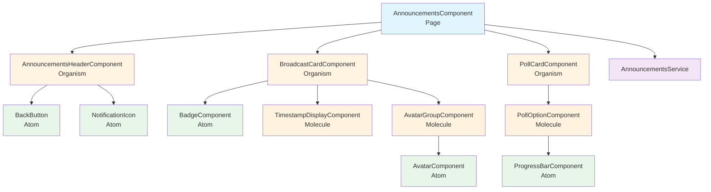
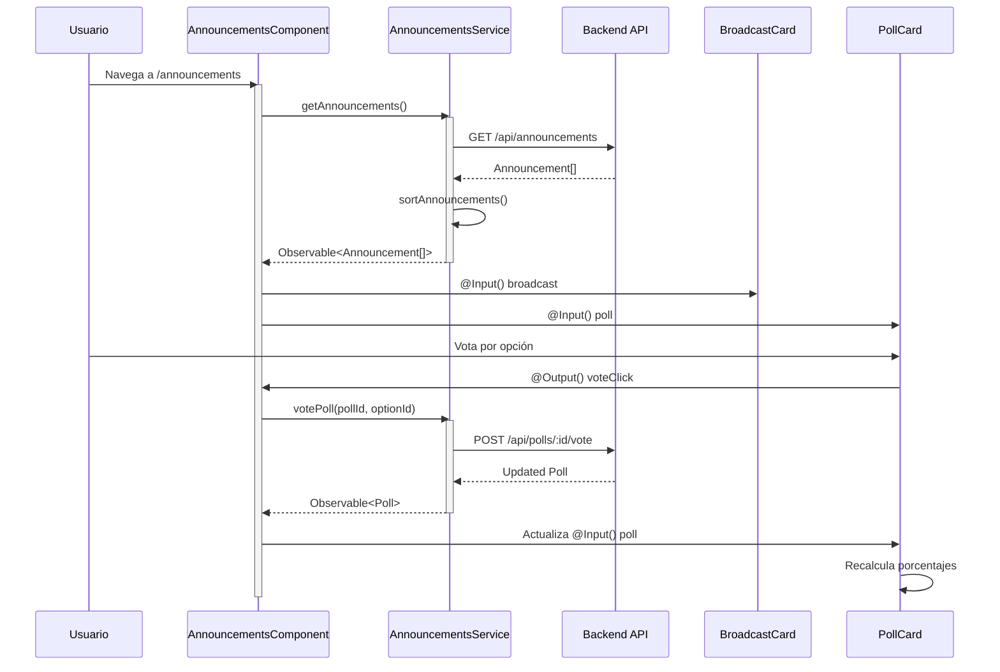
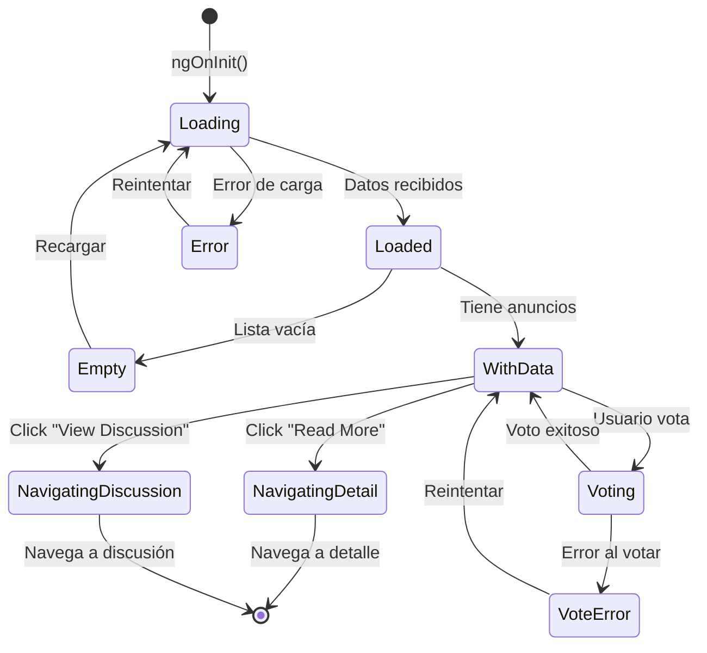

# Documento de Diseño: Vista de Anuncios

## Resumen General

La vista de anuncios es una página de Angular que muestra dos tipos de contenido: mensajes de difusión (broadcasts) y encuestas (polls). La implementación sigue la arquitectura Atomic Design, separando componentes reutilizables (átomos, moléculas, organismos) de la lógica de orquestación de datos (página). La vista será accesible desde la barra de navegación inferior y utilizará componentes standalone de Angular 18.

## Arquitectura

### Estructura de Componentes (Atomic Design)

```
src/app/
├── pages/
│   └── announcements/
│       ├── announcements.component.ts
│       ├── announcements.component.html
│       ├── announcements.component.css
│       └── announcements.component.spec.ts
├── ui/
│   ├── atoms/
│   │   ├── badge/
│   │   │   └── badge.component.ts
│   │   ├── avatar/
│   │   │   └── avatar.component.ts
│   │   └── progress-bar/
│   │       └── progress-bar.component.ts
│   ├── molecules/
│   │   ├── avatar-group/
│   │   │   └── avatar-group.component.ts
│   │   ├── poll-option/
│   │   │   └── poll-option.component.ts
│   │   └── timestamp-display/
│   │       └── timestamp-display.component.ts
│   └── organisms/
│       ├── broadcast-card/
│       │   └── broadcast-card.component.ts
│       ├── poll-card/
│       │   └── poll-card.component.ts
│       └── announcements-header/
│           └── announcements-header.component.ts
├── services/
│   └── announcements.service.ts
└── models/
    └── announcement.model.ts
```

### Flujo de Datos

1. **AnnouncementsComponent (Página)** → Orquesta la carga de datos
2. **AnnouncementsService** → Obtiene datos del backend
3. **Organismos (Cards)** → Reciben datos vía @Input() y emiten eventos vía @Output()
4. **Moléculas y Átomos** → Componentes presentacionales puros

### Patrón de Navegación

```
Tab Bar → Router → AnnouncementsComponent → Renderiza lista de tarjetas
```

## Componentes e Interfaces

### 1. Página: AnnouncementsComponent

**Responsabilidad:** Orquestar la carga de datos, gestionar el estado de la vista y componer los organismos.

**Interfaz:**
```typescript
@Component({
  selector: 'app-announcements',
  standalone: true,
  imports: [
    CommonModule,
    AnnouncementsHeaderComponent,
    BroadcastCardComponent,
    PollCardComponent
  ]
})
export class AnnouncementsComponent implements OnInit {
  announcements$: Observable<Announcement[]>;
  loading: boolean = false;
  error: string | null = null;

  constructor(
    private announcementsService: AnnouncementsService,
    private router: Router
  ) {}

  ngOnInit(): void;
  onReadMore(announcementId: string): void;
  onVote(pollId: string, optionId: string): void;
  onViewDiscussion(pollId: string): void;
  onBack(): void;
  onNotifications(): void;
}
```

**Métodos:**
- `ngOnInit()`: Carga los anuncios al inicializar
- `onReadMore()`: Navega al detalle del mensaje de difusión
- `onVote()`: Registra el voto del usuario en una encuesta
- `onViewDiscussion()`: Navega a la discusión de la encuesta
- `onBack()`: Navega a la vista anterior
- `onNotifications()`: Navega a la vista de notificaciones

### 2. Organismo: AnnouncementsHeaderComponent

**Responsabilidad:** Mostrar el encabezado con título, botón de retroceso e ícono de notificaciones.

**Interfaz:**
```typescript
@Component({
  selector: 'app-announcements-header',
  standalone: true,
  imports: [CommonModule]
})
export class AnnouncementsHeaderComponent {
  @Input() title: string = 'Announcements';
  @Input() showBackButton: boolean = true;
  @Input() showNotificationIcon: boolean = true;
  @Output() backClick = new EventEmitter<void>();
  @Output() notificationClick = new EventEmitter<void>();
}
```

### 3. Organismo: BroadcastCardComponent

**Responsabilidad:** Mostrar un mensaje de difusión con todos sus detalles.

**Interfaz:**
```typescript
@Component({
  selector: 'app-broadcast-card',
  standalone: true,
  imports: [
    CommonModule,
    BadgeComponent,
    TimestampDisplayComponent,
    AvatarGroupComponent
  ]
})
export class BroadcastCardComponent {
  @Input() broadcast: BroadcastMessage;
  @Output() readMoreClick = new EventEmitter<string>();
}
```

### 4. Organismo: PollCardComponent

**Responsabilidad:** Mostrar una encuesta con opciones, resultados y controles de interacción.

**Interfaz:**
```typescript
@Component({
  selector: 'app-poll-card',
  standalone: true,
  imports: [
    CommonModule,
    PollOptionComponent
  ]
})
export class PollCardComponent {
  @Input() poll: Poll;
  @Output() voteClick = new EventEmitter<{ pollId: string; optionId: string }>();
  @Output() viewDiscussionClick = new EventEmitter<string>();
  
  getTimeRemaining(): string;
}
```

### 5. Molécula: AvatarGroupComponent

**Responsabilidad:** Mostrar un grupo de avatares con indicador de cantidad adicional.

**Interfaz:**
```typescript
@Component({
  selector: 'app-avatar-group',
  standalone: true,
  imports: [CommonModule, AvatarComponent]
})
export class AvatarGroupComponent {
  @Input() users: User[];
  @Input() maxVisible: number = 4;
  @Output() groupClick = new EventEmitter<void>();
  
  get visibleUsers(): User[];
  get remainingCount(): number;
}
```

### 6. Molécula: PollOptionComponent

**Responsabilidad:** Mostrar una opción de encuesta con barra de progreso y porcentaje.

**Interfaz:**
```typescript
@Component({
  selector: 'app-poll-option',
  standalone: true,
  imports: [CommonModule, ProgressBarComponent]
})
export class PollOptionComponent {
  @Input() option: PollOption;
  @Input() totalVotes: number;
  @Input() isSelected: boolean = false;
  @Output() optionClick = new EventEmitter<string>();
  
  get percentage(): number;
}
```

### 7. Molécula: TimestampDisplayComponent

**Responsabilidad:** Formatear y mostrar marcas de tiempo de forma legible.

**Interfaz:**
```typescript
@Component({
  selector: 'app-timestamp-display',
  standalone: true,
  imports: [CommonModule]
})
export class TimestampDisplayComponent {
  @Input() timestamp: Date;
  
  get formattedTime(): string;
}
```

### 8. Átomo: BadgeComponent

**Responsabilidad:** Mostrar una insignia con texto (ej: "Urgent").

**Interfaz:**
```typescript
@Component({
  selector: 'app-badge',
  standalone: true,
  imports: [CommonModule]
})
export class BadgeComponent {
  @Input() text: string;
  @Input() variant: 'urgent' | 'info' | 'success' = 'info';
}
```

### 9. Átomo: AvatarComponent

**Responsabilidad:** Mostrar un avatar de usuario.

**Interfaz:**
```typescript
@Component({
  selector: 'app-avatar',
  standalone: true,
  imports: [CommonModule]
})
export class AvatarComponent {
  @Input() imageUrl: string;
  @Input() name: string;
  @Input() size: 'small' | 'medium' | 'large' = 'medium';
}
```

### 10. Átomo: ProgressBarComponent

**Responsabilidad:** Mostrar una barra de progreso con porcentaje.

**Interfaz:**
```typescript
@Component({
  selector: 'app-progress-bar',
  standalone: true,
  imports: [CommonModule]
})
export class ProgressBarComponent {
  @Input() percentage: number;
  @Input() color: string = '#007bff';
  @Input() height: string = '8px';
}
```

### 11. Servicio: AnnouncementsService

**Responsabilidad:** Gestionar la comunicación con el backend para obtener y actualizar anuncios.

**Interfaz:**
```typescript
@Injectable({ providedIn: 'root' })
export class AnnouncementsService {
  private apiUrl = '/api/announcements';
  
  constructor(private http: HttpClient) {}
  
  getAnnouncements(): Observable<Announcement[]>;
  getBroadcastById(id: string): Observable<BroadcastMessage>;
  votePoll(pollId: string, optionId: string): Observable<Poll>;
  getPollDiscussion(pollId: string): Observable<Discussion>;
}
```

**Métodos:**
- `getAnnouncements()`: Obtiene la lista completa de anuncios ordenados
- `getBroadcastById()`: Obtiene el detalle completo de un mensaje de difusión
- `votePoll()`: Registra un voto y devuelve la encuesta actualizada
- `getPollDiscussion()`: Obtiene la discusión asociada a una encuesta

## Modelos de Datos

### Announcement (Tipo Unión)

```typescript
export type Announcement = BroadcastMessage | Poll;

export interface BaseAnnouncement {
  id: string;
  type: 'broadcast' | 'poll';
  createdAt: Date;
  priority: number;
}
```

### BroadcastMessage

```typescript
export interface BroadcastMessage extends BaseAnnouncement {
  type: 'broadcast';
  title: string;
  description: string;
  previewText: string;
  isUrgent: boolean;
  backgroundColor: string;
  relatedUsers: User[];
}
```

### Poll

```typescript
export interface Poll extends BaseAnnouncement {
  type: 'poll';
  title: string;
  question: string;
  icon: string;
  endsAt: Date;
  options: PollOption[];
  totalVotes: number;
  userVote?: string; // ID de la opción votada por el usuario
  discussionId: string;
}
```

### PollOption

```typescript
export interface PollOption {
  id: string;
  text: string;
  votes: number;
}
```

### User

```typescript
export interface User {
  id: string;
  name: string;
  avatarUrl: string;
}
```

### Discussion

```typescript
export interface Discussion {
  id: string;
  pollId: string;
  messages: DiscussionMessage[];
}

export interface DiscussionMessage {
  id: string;
  userId: string;
  userName: string;
  text: string;
  createdAt: Date;
}
```

## Propiedades de Corrección

*Una propiedad es una característica o comportamiento que debe mantenerse verdadero en todas las ejecuciones válidas de un sistema. Las propiedades sirven como puente entre las especificaciones legibles por humanos y las garantías de corrección verificables por máquinas.*


### Reflexión sobre Propiedades

Después de analizar los criterios de aceptación, he identificado las siguientes propiedades testables. Ahora realizaré una reflexión para eliminar redundancias:

**Propiedades de Renderizado de Tarjetas (2.1-2.8, 4.1-4.9):**
- Las propiedades 2.2, 2.4, 2.5, 2.6, 2.7, 2.8 todas verifican que elementos específicos están presentes en una tarjeta de broadcast
- Las propiedades 4.2, 4.3, 4.4, 4.5, 4.6, 4.7, 4.8, 4.9 todas verifican que elementos específicos están presentes en una tarjeta de poll
- **Consolidación:** Estas pueden combinarse en dos propiedades comprehensivas: una para broadcast cards y otra para poll cards que verifiquen todos los elementos requeridos

**Propiedades de Votación (5.1, 5.2, 5.3):**
- 5.1 verifica que el voto se registra
- 5.2 verifica que los porcentajes se actualizan
- 5.3 verifica que el total se incrementa
- **Análisis:** Estas tres propiedades están relacionadas pero cada una verifica un aspecto diferente del comportamiento de votación. 5.3 es una propiedad matemática simple (invariante), mientras que 5.1 y 5.2 verifican efectos secundarios. Se mantendrán separadas.

**Propiedades de Ordenamiento (6.1, 6.2, 6.3):**
- 6.1 verifica orden por urgencia
- 6.2 verifica orden por timestamp dentro de la misma prioridad
- 6.3 verifica priorización de encuestas próximas a vencer
- **Consolidación:** Estas pueden combinarse en una sola propiedad comprehensiva sobre el algoritmo de ordenamiento completo

**Propiedades de Avatar Group (10.1, 10.2):**
- 10.1 verifica que solo se muestran 4 avatares
- 10.2 verifica que el indicador +N es correcto
- **Análisis:** Estas dos propiedades están estrechamente relacionadas y pueden combinarse en una sola propiedad sobre el comportamiento del avatar group

### Propiedades de Corrección

#### Propiedad 1: Renderizado completo de tarjetas de broadcast

*Para cualquier* mensaje de difusión (BroadcastMessage), cuando se renderiza como BroadcastCardComponent, el HTML resultante debe contener:
- Un fondo de color (backgroundColor aplicado)
- La marca de tiempo formateada
- El título del mensaje
- El texto de vista previa
- El grupo de avatares de usuarios relacionados
- El botón "Read More"
- La insignia "Urgent" si y solo si isUrgent es true

**Valida: Requisitos 2.1, 2.2, 2.3, 2.4, 2.5, 2.6, 2.7, 2.8**

#### Propiedad 2: Renderizado completo de tarjetas de encuesta

*Para cualquier* encuesta (Poll), cuando se renderiza como PollCardComponent, el HTML resultante debe contener:
- El ícono indicador del tema
- El título de la encuesta
- El tiempo restante calculado correctamente
- La pregunta de la encuesta
- Todas las opciones de respuesta (número de elementos PollOption = número de opciones en poll.options)
- Barras de progreso con porcentajes para cada opción
- El número total de votos
- El enlace "View Discussion"

**Valida: Requisitos 4.1, 4.2, 4.3, 4.4, 4.5, 4.6, 4.7, 4.8, 4.9**

#### Propiedad 3: Invariante de incremento de votos

*Para cualquier* encuesta con un total de votos N, cuando un usuario vota por cualquier opción, el total de votos debe ser exactamente N + 1.

**Valida: Requisitos 5.3**

#### Propiedad 4: Actualización de porcentajes tras votación

*Para cualquier* encuesta, cuando un usuario vota por una opción, la suma de todos los porcentajes de las opciones debe ser 100% (con tolerancia de ±0.1% por redondeo), y cada porcentaje debe ser igual a (votos de la opción / total de votos) × 100.

**Valida: Requisitos 5.2**

#### Propiedad 5: Persistencia de voto del usuario

*Para cualquier* encuesta y cualquier opción seleccionada, después de que un usuario vota, la propiedad poll.userVote debe contener el ID de la opción votada, y esa opción debe estar marcada visualmente como seleccionada en la UI.

**Valida: Requisitos 5.1, 5.4**

#### Propiedad 6: Ordenamiento de anuncios

*Para cualquier* lista de anuncios (Announcement[]), el resultado de aplicar el algoritmo de ordenamiento debe cumplir:
1. Todos los elementos con isUrgent=true (broadcasts) o con endsAt cercano (polls) aparecen antes que los demás
2. Dentro de cada grupo de prioridad, los elementos están ordenados por createdAt descendente (más reciente primero)
3. El orden es estable (elementos con misma prioridad y timestamp mantienen su orden relativo)

**Valida: Requisitos 6.1, 6.2, 6.3**

#### Propiedad 7: Formato de timestamp con AM/PM

*Para cualquier* marca de tiempo (Date), cuando se formatea usando TimestampDisplayComponent, el resultado debe usar formato de 12 horas con sufijo AM o PM (nunca formato de 24 horas).

**Valida: Requisitos 8.4**

#### Propiedad 8: Límite de avatares visibles

*Para cualquier* lista de usuarios con N elementos, cuando se renderiza con AvatarGroupComponent:
- Si N ≤ 4: se muestran exactamente N avatares y no hay indicador "+X"
- Si N > 4: se muestran exactamente 4 avatares y el indicador muestra "+(N-4)"

**Valida: Requisitos 10.1, 10.2**

#### Propiedad 9: Cálculo de porcentajes de encuesta

*Para cualquier* opción de encuesta (PollOption) con V votos en una encuesta con T votos totales, el porcentaje calculado por PollOptionComponent debe ser exactamente (V / T) × 100, redondeado a un decimal.

**Valida: Requisitos 4.7**

## Manejo de Errores

### Estrategias de Manejo de Errores

1. **Errores de Carga de Datos**
   - El servicio AnnouncementsService debe capturar errores HTTP usando RxJS catchError
   - Retornar un Observable con un array vacío o lanzar un error manejable
   - El componente debe mostrar un mensaje de error amigable al usuario

2. **Estados Vacíos**
   - Cuando no hay anuncios disponibles, mostrar un estado vacío con mensaje informativo
   - Incluir un ícono ilustrativo y texto explicativo
   - Opcionalmente, ofrecer un botón para recargar

3. **Errores de Votación**
   - Si el voto falla, mostrar un mensaje de error temporal (toast/snackbar)
   - No actualizar la UI hasta confirmar que el voto se registró en el backend
   - Permitir reintentar la operación

4. **Datos Inválidos**
   - Validar que los datos recibidos del backend cumplen con las interfaces TypeScript
   - Si faltan campos requeridos, usar valores por defecto seguros
   - Registrar errores en la consola para debugging

5. **Navegación Fallida**
   - Si la navegación a una vista de detalle falla, mostrar mensaje de error
   - Mantener al usuario en la vista actual
   - Ofrecer opción de volver a intentar

### Códigos de Error

```typescript
export enum AnnouncementErrorCode {
  LOAD_FAILED = 'LOAD_FAILED',
  VOTE_FAILED = 'VOTE_FAILED',
  INVALID_DATA = 'INVALID_DATA',
  NAVIGATION_FAILED = 'NAVIGATION_FAILED',
  NETWORK_ERROR = 'NETWORK_ERROR'
}

export interface AnnouncementError {
  code: AnnouncementErrorCode;
  message: string;
  details?: any;
}
```

## Estrategia de Pruebas

### Enfoque Dual de Pruebas

La estrategia de pruebas combina **pruebas unitarias** y **pruebas basadas en propiedades** para lograr cobertura comprehensiva:

- **Pruebas unitarias**: Verifican ejemplos específicos, casos borde y condiciones de error
- **Pruebas basadas en propiedades**: Verifican propiedades universales a través de múltiples entradas generadas

Ambos tipos de pruebas son complementarios y necesarios. Las pruebas unitarias capturan bugs concretos y casos específicos, mientras que las pruebas de propiedades verifican corrección general.

### Balance de Pruebas Unitarias

- Evitar escribir demasiadas pruebas unitarias - las pruebas de propiedades manejan la cobertura de múltiples inputs
- Las pruebas unitarias deben enfocarse en:
  - Ejemplos específicos que demuestran comportamiento correcto
  - Puntos de integración entre componentes
  - Casos borde y condiciones de error
- Las pruebas de propiedades deben enfocarse en:
  - Propiedades universales que se mantienen para todas las entradas
  - Cobertura comprehensiva de inputs mediante aleatorización

### Biblioteca de Property-Based Testing

Para este proyecto usaremos **fast-check** (https://github.com/dubzzz/fast-check), la biblioteca líder de property-based testing para TypeScript/JavaScript.

Instalación:
```bash
npm install --save-dev fast-check
```

### Configuración de Pruebas de Propiedades

- Cada prueba de propiedad debe ejecutarse con **mínimo 100 iteraciones**
- Cada prueba debe referenciar su propiedad del documento de diseño
- Formato de etiqueta: **Feature: announcements-view, Property {número}: {texto de la propiedad}**
- Cada propiedad de corrección debe implementarse con UNA SOLA prueba basada en propiedades

### Plan de Pruebas por Componente

#### AnnouncementsComponent (Página)
**Pruebas Unitarias:**
- Verifica que se carga la lista de anuncios al inicializar
- Verifica manejo de estado de carga (loading=true durante carga)
- Verifica manejo de estado vacío (lista vacía)
- Verifica manejo de errores de carga
- Verifica navegación al hacer clic en "Read More"
- Verifica navegación al hacer clic en "View Discussion"

**Pruebas de Propiedades:**
- Ninguna (la lógica de ordenamiento se prueba en el servicio)

#### AnnouncementsService
**Pruebas Unitarias:**
- Verifica que getAnnouncements() hace la petición HTTP correcta
- Verifica que votePoll() envía los datos correctos
- Verifica manejo de errores HTTP

**Pruebas de Propiedades:**
- **Propiedad 6**: Ordenamiento de anuncios (generar listas aleatorias y verificar orden)

#### BroadcastCardComponent
**Pruebas Unitarias:**
- Verifica renderizado con datos mínimos
- Verifica que el evento readMoreClick se emite correctamente

**Pruebas de Propiedades:**
- **Propiedad 1**: Renderizado completo de tarjetas de broadcast (generar broadcasts aleatorios)

#### PollCardComponent
**Pruebas Unitarias:**
- Verifica renderizado con datos mínimos
- Verifica que los eventos se emiten correctamente
- Verifica cálculo de tiempo restante

**Pruebas de Propiedades:**
- **Propiedad 2**: Renderizado completo de tarjetas de encuesta (generar polls aleatorios)
- **Propiedad 3**: Invariante de incremento de votos
- **Propiedad 4**: Actualización de porcentajes tras votación
- **Propiedad 5**: Persistencia de voto del usuario

#### PollOptionComponent
**Pruebas Unitarias:**
- Verifica renderizado básico
- Verifica que el evento optionClick se emite

**Pruebas de Propiedades:**
- **Propiedad 9**: Cálculo de porcentajes de encuesta (generar opciones con votos aleatorios)

#### AvatarGroupComponent
**Pruebas Unitarias:**
- Verifica renderizado con 0 usuarios
- Verifica renderizado con exactamente 4 usuarios
- Verifica que el evento groupClick se emite

**Pruebas de Propiedades:**
- **Propiedad 8**: Límite de avatares visibles (generar listas de usuarios de tamaño aleatorio)

#### TimestampDisplayComponent
**Pruebas Unitarias:**
- Verifica formato "Today" para fecha de hoy
- Verifica formato "Yesterday" para fecha de ayer
- Verifica formato de fecha completa para fechas antiguas

**Pruebas de Propiedades:**
- **Propiedad 7**: Formato de timestamp con AM/PM (generar fechas aleatorias)

#### BadgeComponent, AvatarComponent, ProgressBarComponent
**Pruebas Unitarias:**
- Verificar renderizado básico con diferentes inputs
- Verificar aplicación de estilos según variantes

**Pruebas de Propiedades:**
- Ninguna (componentes demasiado simples)

### Generadores para Property-Based Testing

Los generadores deben crearse en `src/app/testing/generators.ts`:

```typescript
import * as fc from 'fast-check';
import { BroadcastMessage, Poll, PollOption, User, Announcement } from '../models/announcement.model';

// Generador de usuarios
export const userArbitrary = (): fc.Arbitrary<User> => {
  return fc.record({
    id: fc.uuid(),
    name: fc.string({ minLength: 1, maxLength: 50 }),
    avatarUrl: fc.webUrl()
  });
};

// Generador de opciones de encuesta
export const pollOptionArbitrary = (): fc.Arbitrary<PollOption> => {
  return fc.record({
    id: fc.uuid(),
    text: fc.string({ minLength: 1, maxLength: 100 }),
    votes: fc.nat({ max: 10000 })
  });
};

// Generador de mensajes de difusión
export const broadcastMessageArbitrary = (): fc.Arbitrary<BroadcastMessage> => {
  return fc.record({
    id: fc.uuid(),
    type: fc.constant('broadcast' as const),
    createdAt: fc.date(),
    priority: fc.integer({ min: 0, max: 10 }),
    title: fc.string({ minLength: 1, maxLength: 100 }),
    description: fc.string({ minLength: 10, maxLength: 500 }),
    previewText: fc.string({ minLength: 10, maxLength: 150 }),
    isUrgent: fc.boolean(),
    backgroundColor: fc.hexaString({ minLength: 6, maxLength: 6 }).map(s => `#${s}`),
    relatedUsers: fc.array(userArbitrary(), { minLength: 0, maxLength: 20 })
  });
};

// Generador de encuestas
export const pollArbitrary = (): fc.Arbitrary<Poll> => {
  return fc.record({
    id: fc.uuid(),
    type: fc.constant('poll' as const),
    createdAt: fc.date(),
    priority: fc.integer({ min: 0, max: 10 }),
    title: fc.string({ minLength: 1, maxLength: 100 }),
    question: fc.string({ minLength: 10, maxLength: 200 }),
    icon: fc.string({ minLength: 1, maxLength: 50 }),
    endsAt: fc.date({ min: new Date() }),
    options: fc.array(pollOptionArbitrary(), { minLength: 2, maxLength: 6 }),
    totalVotes: fc.nat({ max: 10000 }),
    userVote: fc.option(fc.uuid(), { nil: undefined }),
    discussionId: fc.uuid()
  });
};

// Generador de anuncios (unión de broadcasts y polls)
export const announcementArbitrary = (): fc.Arbitrary<Announcement> => {
  return fc.oneof(broadcastMessageArbitrary(), pollArbitrary());
};
```

### Ejemplo de Prueba de Propiedad

```typescript
import * as fc from 'fast-check';
import { announcementArbitrary } from '../testing/generators';

describe('AnnouncementsService - Property Tests', () => {
  it('Feature: announcements-view, Property 6: Ordenamiento de anuncios', () => {
    fc.assert(
      fc.property(
        fc.array(announcementArbitrary(), { minLength: 0, maxLength: 50 }),
        (announcements) => {
          const sorted = service.sortAnnouncements(announcements);
          
          // Verificar que mensajes urgentes y polls próximos a vencer están primero
          for (let i = 0; i < sorted.length - 1; i++) {
            const current = sorted[i];
            const next = sorted[i + 1];
            
            const currentPriority = getPriority(current);
            const nextPriority = getPriority(next);
            
            if (currentPriority === nextPriority) {
              // Mismo nivel de prioridad: debe estar ordenado por fecha descendente
              expect(current.createdAt.getTime()).toBeGreaterThanOrEqual(next.createdAt.getTime());
            } else {
              // Diferente prioridad: el actual debe tener mayor prioridad
              expect(currentPriority).toBeGreaterThan(nextPriority);
            }
          }
        }
      ),
      { numRuns: 100 }
    );
  });
});
```

### Cobertura de Código

- Objetivo: 80% de cobertura de líneas para componentes y servicios
- Objetivo: 90% de cobertura para lógica de negocio crítica (ordenamiento, cálculos)
- Usar Karma Coverage para generar reportes
- Excluir archivos de prueba y generadores de la cobertura

### Pruebas de Integración

Además de las pruebas unitarias y de propiedades, se deben crear pruebas de integración para:
- Flujo completo: cargar anuncios → renderizar → interactuar → navegar
- Integración entre AnnouncementsComponent y AnnouncementsService
- Integración entre PollCardComponent y PollOptionComponent

### Ejecución de Pruebas

```bash
# Ejecutar todas las pruebas
npm test

# Ejecutar pruebas con cobertura
npm test -- --code-coverage

# Ejecutar pruebas en modo watch (desarrollo)
npm test -- --watch
```


## Diagramas

### Diagrama de Arquitectura de Componentes



### Diagrama de Flujo de Datos



### Diagrama de Estados de la Vista



## Detalles de Implementación

### Algoritmo de Ordenamiento

El algoritmo de ordenamiento debe implementarse en `AnnouncementsService`:

```typescript
sortAnnouncements(announcements: Announcement[]): Announcement[] {
  return [...announcements].sort((a, b) => {
    // Calcular prioridad
    const priorityA = this.calculatePriority(a);
    const priorityB = this.calculatePriority(b);
    
    // Ordenar por prioridad descendente
    if (priorityA !== priorityB) {
      return priorityB - priorityA;
    }
    
    // Si tienen la misma prioridad, ordenar por fecha descendente
    return b.createdAt.getTime() - a.createdAt.getTime();
  });
}

private calculatePriority(announcement: Announcement): number {
  let priority = announcement.priority || 0;
  
  // Aumentar prioridad para mensajes urgentes
  if (announcement.type === 'broadcast' && announcement.isUrgent) {
    priority += 100;
  }
  
  // Aumentar prioridad para encuestas próximas a vencer (< 24 horas)
  if (announcement.type === 'poll') {
    const hoursRemaining = (announcement.endsAt.getTime() - Date.now()) / (1000 * 60 * 60);
    if (hoursRemaining < 24 && hoursRemaining > 0) {
      priority += 50;
    }
  }
  
  return priority;
}
```

### Cálculo de Tiempo Restante

Implementado en `PollCardComponent`:

```typescript
getTimeRemaining(): string {
  const now = new Date().getTime();
  const end = this.poll.endsAt.getTime();
  const diff = end - now;
  
  if (diff <= 0) {
    return 'Ended';
  }
  
  const days = Math.floor(diff / (1000 * 60 * 60 * 24));
  const hours = Math.floor((diff % (1000 * 60 * 60 * 24)) / (1000 * 60 * 60));
  
  if (days > 0) {
    return `Ends in ${days} day${days > 1 ? 's' : ''}`;
  } else if (hours > 0) {
    return `Ends in ${hours} hour${hours > 1 ? 's' : ''}`;
  } else {
    const minutes = Math.floor((diff % (1000 * 60 * 60)) / (1000 * 60));
    return `Ends in ${minutes} minute${minutes > 1 ? 's' : ''}`;
  }
}
```

### Formateo de Timestamp

Implementado en `TimestampDisplayComponent`:

```typescript
get formattedTime(): string {
  const now = new Date();
  const date = new Date(this.timestamp);
  
  // Resetear horas para comparación de días
  const today = new Date(now.getFullYear(), now.getMonth(), now.getDate());
  const yesterday = new Date(today);
  yesterday.setDate(yesterday.getDate() - 1);
  const messageDate = new Date(date.getFullYear(), date.getMonth(), date.getDate());
  
  const timeStr = this.formatTime12Hour(date);
  
  if (messageDate.getTime() === today.getTime()) {
    return `Today, ${timeStr}`;
  } else if (messageDate.getTime() === yesterday.getTime()) {
    return `Yesterday, ${timeStr}`;
  } else {
    return `${this.formatDate(date)}, ${timeStr}`;
  }
}

private formatTime12Hour(date: Date): string {
  let hours = date.getHours();
  const minutes = date.getMinutes();
  const ampm = hours >= 12 ? 'PM' : 'AM';
  
  hours = hours % 12;
  hours = hours ? hours : 12; // 0 se convierte en 12
  
  const minutesStr = minutes < 10 ? '0' + minutes : minutes.toString();
  
  return `${hours}:${minutesStr} ${ampm}`;
}

private formatDate(date: Date): string {
  const months = ['Jan', 'Feb', 'Mar', 'Apr', 'May', 'Jun', 
                  'Jul', 'Aug', 'Sep', 'Oct', 'Nov', 'Dec'];
  return `${months[date.getMonth()]} ${date.getDate()}, ${date.getFullYear()}`;
}
```

### Cálculo de Porcentajes

Implementado en `PollOptionComponent`:

```typescript
get percentage(): number {
  if (this.totalVotes === 0) {
    return 0;
  }
  return Math.round((this.option.votes / this.totalVotes) * 1000) / 10;
}
```

### Gestión de Estado de Votación

En `AnnouncementsComponent`:

```typescript
onVote(pollId: string, optionId: string): void {
  this.announcementsService.votePoll(pollId, optionId)
    .pipe(
      catchError(error => {
        this.showError('Failed to register vote. Please try again.');
        return EMPTY;
      })
    )
    .subscribe(updatedPoll => {
      // Actualizar la encuesta en la lista
      this.announcements$ = this.announcements$.pipe(
        map(announcements => 
          announcements.map(a => 
            a.id === pollId ? updatedPoll : a
          )
        )
      );
    });
}
```

## Consideraciones de Rendimiento

### Optimizaciones

1. **Lazy Loading de Componentes**
   - La ruta de announcements usa lazy loading para reducir el bundle inicial
   - Cada organismo es un componente standalone que se carga bajo demanda

2. **Change Detection Strategy**
   - Usar `ChangeDetectionStrategy.OnPush` en todos los componentes presentacionales
   - Reduce el número de verificaciones de cambios en el árbol de componentes

3. **Virtual Scrolling**
   - Si la lista de anuncios crece significativamente (>100 items), considerar usar Angular CDK Virtual Scrolling
   - Renderiza solo los elementos visibles en el viewport

4. **Memoización de Cálculos**
   - Cachear el resultado de `getTimeRemaining()` y actualizar solo cada minuto
   - Cachear el resultado de `sortAnnouncements()` hasta que cambien los datos

5. **Imágenes Optimizadas**
   - Usar lazy loading para avatares: `loading="lazy"`
   - Considerar usar placeholders mientras cargan las imágenes

### Métricas de Rendimiento

- Tiempo de carga inicial: < 2 segundos
- Tiempo de renderizado de lista (50 items): < 500ms
- Tiempo de respuesta a interacción (voto): < 100ms (UI), < 1s (backend)

## Consideraciones de Accesibilidad

### ARIA Labels y Roles

1. **Encabezado**
   - Botón de retroceso: `aria-label="Go back"`
   - Botón de notificaciones: `aria-label="View notifications"`

2. **Tarjetas de Anuncios**
   - Usar `role="article"` para cada tarjeta
   - Insignia urgente: `aria-label="Urgent announcement"`

3. **Encuestas**
   - Opciones de voto: `role="radio"` o `role="button"`
   - Grupo de opciones: `role="radiogroup"` con `aria-labelledby` apuntando al título
   - Anunciar resultado de voto con `aria-live="polite"`

4. **Estados de Carga**
   - Indicador de carga: `aria-busy="true"` y `aria-label="Loading announcements"`
   - Estado vacío: Mensaje descriptivo visible

### Navegación por Teclado

- Todas las tarjetas deben ser navegables con Tab
- Botones deben activarse con Enter o Space
- Opciones de encuesta deben ser seleccionables con flechas arriba/abajo
- Implementar `tabindex` apropiado en elementos interactivos

### Contraste de Color

- Asegurar ratio de contraste mínimo 4.5:1 para texto normal
- Ratio de contraste mínimo 3:1 para texto grande y elementos UI
- Probar con herramientas como WAVE o axe DevTools

## Consideraciones de Seguridad

### Sanitización de Contenido

- Todo contenido HTML recibido del backend debe sanitizarse usando `DomSanitizer`
- Prevenir ataques XSS en títulos, descripciones y nombres de usuario
- Validar URLs de avatares antes de renderizar

### Validación de Datos

- Validar que los IDs de encuestas y opciones son UUIDs válidos
- Verificar que los porcentajes suman 100% (con tolerancia)
- Validar rangos de fechas (endsAt debe ser futuro, createdAt debe ser pasado)

### Autenticación y Autorización

- Verificar que el usuario está autenticado antes de permitir votar
- Validar en el backend que el usuario no ha votado previamente
- Implementar rate limiting para prevenir spam de votos

## Extensibilidad Futura

### Características Potenciales

1. **Filtros y Búsqueda**
   - Filtrar por tipo (broadcasts vs polls)
   - Filtrar por urgencia
   - Búsqueda por texto en títulos y descripciones

2. **Notificaciones Push**
   - Notificar cuando hay nuevos anuncios urgentes
   - Recordatorios para encuestas próximas a vencer

3. **Comentarios en Anuncios**
   - Permitir comentarios en mensajes de difusión
   - Expandir la funcionalidad de discusión

4. **Reacciones**
   - Permitir reacciones emoji en anuncios
   - Mostrar contador de reacciones

5. **Compartir**
   - Compartir anuncios por email o redes sociales
   - Generar enlaces directos a anuncios específicos

### Puntos de Extensión

- `AnnouncementType`: Extender el tipo unión para nuevos tipos de anuncios
- `AnnouncementsService`: Agregar métodos para nuevas operaciones
- Componentes de tarjeta: Crear nuevos organismos para nuevos tipos de contenido

## Dependencias Externas

### Bibliotecas Requeridas

- **Angular 18.2**: Framework principal
- **RxJS 7.8**: Programación reactiva
- **fast-check**: Property-based testing (dev dependency)

### Bibliotecas Opcionales

- **date-fns** o **dayjs**: Manipulación de fechas más robusta (alternativa a Date nativo)
- **Angular CDK**: Virtual scrolling y utilidades de accesibilidad
- **ngx-skeleton-loader**: Skeleton screens durante carga

## Configuración de Rutas

Agregar a `src/app/app.routes.ts`:

```typescript
{
  path: 'announcements',
  loadComponent: () => import('./pages/announcements/announcements.component')
    .then(m => m.AnnouncementsComponent)
},
{
  path: 'announcements/:id',
  loadComponent: () => import('./pages/announcement-detail/announcement-detail.component')
    .then(m => m.AnnouncementDetailComponent)
},
{
  path: 'polls/:id/discussion',
  loadComponent: () => import('./pages/poll-discussion/poll-discussion.component')
    .then(m => m.PollDiscussionComponent)
}
```

## Notas de Implementación

1. **Orden de Implementación Recomendado**:
   - Primero: Modelos de datos y servicio
   - Segundo: Átomos (Badge, Avatar, ProgressBar)
   - Tercero: Moléculas (AvatarGroup, PollOption, TimestampDisplay)
   - Cuarto: Organismos (Header, BroadcastCard, PollCard)
   - Quinto: Página (AnnouncementsComponent)
   - Sexto: Pruebas (unitarias y de propiedades)

2. **Datos Mock para Desarrollo**:
   - Crear un servicio mock que devuelva datos de ejemplo
   - Usar interceptores HTTP para simular respuestas del backend
   - Facilita desarrollo sin dependencia del backend

3. **Estilos CSS**:
   - Usar variables CSS para colores y espaciado consistente
   - Implementar diseño responsivo con media queries
   - Considerar usar Tailwind CSS o Angular Material para acelerar desarrollo

4. **Internacionalización**:
   - Aunque el documento está en español, el código debe usar inglés
   - Preparar para i18n futuro usando Angular i18n o ngx-translate
   - Externalizar todos los strings visibles al usuario
